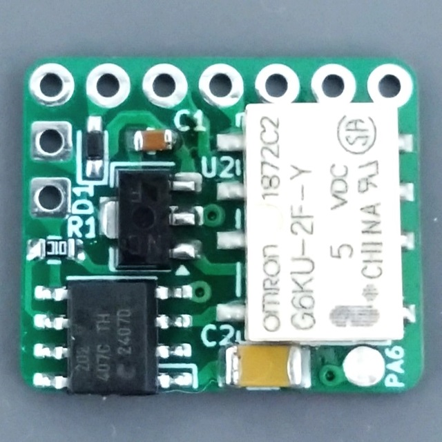
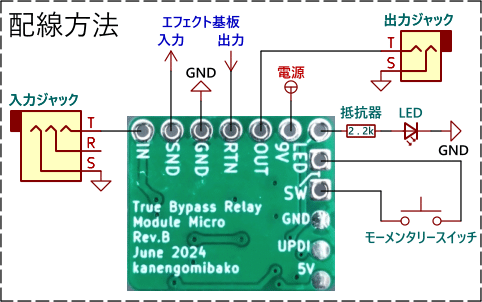

# True Bypass Relay Module Micro

 
モーメンタリースイッチを接続して、エフェクターのトゥルーバイパスとインジケーターLED切替を行うことができるモジュールです。

### 配線方法

 

- IN → 入力ジャック
- SND → エフェクト基板の入力
- GND → グラウンド（アース）
- RTN → エフェクト基板の出力
- OUT → 出力ジャック
- 9V → 電源
- LED → LEDの電流制限抵抗とLED ※ エフェクトオン時に5Vが出力されます。電流制限抵抗の抵抗値は470Ω以上を推奨します。
- SW → スイッチ（接続は上下入れ替わってもOK） ※ モーメンタリー（モメンタリ）のスイッチを使用します。SPST（単極単投、1回路1接点）のものが入手しやすいです。

### 機能設定

スイッチを押す度にエフェクトオンとバイパスが切り替わる通常モードと、スイッチを押している間のみエフェクトオンになるモーメンタリーモードがあります。また、電源を入れたときに自動でエフェクトオンにするかどうかを設定できます。設定は自動保存され、電源を切っても記憶されています。

- 起動時エフェクトオン機能切替 スイッチを押しながら電源を入れます。設定完了時にLEDが2回点滅します。
- モーメンタリーモード・通常モード切替  スイッチを押しながら電源を入れ、そのまま約3秒間スイッチを押し続けます。設定完了時にLEDが3回点滅します。 ※ モーメンタリーモードの状態で起動時エフェクトオンに設定にすると、スイッチを押している間のみバイパス状態となるモードになります。

### 資料

- [True Bypass Relay Module Micro 製作に関する記事](https://kanengomibako.github.io/pages/00349.html)

| 主な仕様 |  |
| - | - |
| 出荷時設定 | 通常モード　起動時エフェクトバイパス |
| 使用可能電源電圧範囲 | 7V ～ 20V |
| 消費電流 | 3mA（オン・オフ切替の一瞬のみ21mA消費電流増加） |
| 外形寸法 | 幅 18 mm × 奥行 15 mm × 高さ 7 mm |
| 質量 | 約 1.5 g |